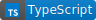

# linear-regression 

[](https://www.typescriptlang.org/)
[](https://nodejs.dev/en/)
[](https://npmjs.org)


Simple linear regression made in Typescript

## how to install 

`npm i linear-regression` or `yarn add linear-regression` if you
use yarn instead of npm.

## how to use 

### linear regression

```js
import linearRegression from "linear-regression";

const x = [1, 2, 3, 4];
const y = [1, 2, 3, 4];
const lr = linearRegression(x, y); // if you want values into an Object
const { a, b } = lr // if you only want a and b values
```

### covariance 

```js
import { covariance } from "linear-regression";

const x = [1, 2, 3, 4];
const y = [1, 2, 3, 4];
const cov = covariance(x, y); // it gives you the covariance of x and y
```

### variance 

```js
import { variance } from "linear-regression";

const x = [1, 2, 3, 4];
const vari = variance(x); // it gives you the variance of x
```

## how it is calculated 

this package use the Covariance and Variance to calculate the linear regression,
see here : https://en.wikipedia.org/wiki/Linear_regression
