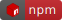

# linear-regression 

[](https://developer.mozilla.org/fr/docs/Web/JavaScript)
[](https://nodejs.dev/en/)
[](https://www.npmjs.com/package/clementreiffers-linear-regression)


Simple linear regression made in JavaScript.


## How to install 

`npm i clementreiffers-linear-regression` or `yarn add clementreiffers-linear-regression` if you
use yarn instead of npm.

## How to use 

>**:warning: WARNING**
>the version 2 is not compatible with version 1

### Linear Regression

#### The lightest function

the lightest function is very usefull if you're interested in getting only the essential
parameters

```js
import { linearRegression, predict } from "clementreiffers-linear-regression";
// import { computeLightLinearRegression } from "clementreiffers-linear-regression";

const x = [1, 2, 3, 4];
const y = [1, 2, 3, 4];
const lr = linearRegression(x, y, true); // if you want values into an Object

// executed only if true in linearRegression Function, it gives the same result as above
// computeLightLinearRegression(x, y);  

const pred1 = predict([1, 2], lr);
const pred2 = predict(6, lr);

console.log(lr); // to show the object which represents the linear regression
console.log(pred1); // to show the prediction of an array
console.log(pred2); // to show th prediction of a number

```

by trying this example above, you will have :

```text
{ parameters: { a: 1, b: 0 } }
[ 1, 2 ]
6
```

#### The loudest function

it will compute all necessary calculations and put it into the same json.

```js
import { linearRegression, predict } from "clementreiffers-linear-regression";
// import { computeLoudLinearRegression } from "clementreiffers-linear-regression";

const x = [1, 2, 3, 4];
const y = [1, 2, 3, 4];
const lr = linearRegression(x, y); // if you want values into an Object

// executed by default, it gives the same result as above
// computeLoudLinearRegression(x, y); 

const pred1 = predict([1, 2], lr);
const pred2 = predict(6, lr);

console.log(lr); // to show the object which represents the linear regression
console.log(pred1); // to show the prediction of an array
console.log(pred2); // to show th prediction of a number

```

by trying this example above, you will have :

```text
{
  parameters: { a: 1, b: 0 },
  trainData: { x: [ 1, 2, 3, 4 ], y: [ 1, 2, 3, 4 ] },
  trainCurvePredict: [ 1, 2, 3, 4 ],
  statistics: { r2: 0.9999999999999996, cost: 0, pearson: 0.9999999999999998 }
}
[ 1, 2 ]
6
```

### Covariance 

```js
import { covariance } from "clementreiffers-linear-regression";

const x = [1, 2, 3, 4];
const y = [1, 2, 3, 4];
const cov = covariance(x, y); // it gives you the covariance of x and y
console.log(cov);
```

by trying this example above you will have : 

```text
1.25
```


### score

the score represents the capacity to do a linear regression with the data given.

```js 
import { score } from "clementreiffers-linear-regression";

const x = [1, 2, 3, 4];
const y = [1, 2, 3, 4];

console.log(score(x, y));

```

by executing this code you will have :

```text
0.9999999999999996
```

### cost function

```js
import { linearRegression, costFunction } from "clementreiffers-linear-regression";

const x = [1, 2, 3, 4];
const y = [1, 2, 3, 4];

const lr = linearRegression(x, y);
const pred = predict(lr, x);

const cost = costFunction(y, pred);
console.log(cost);
```

by executing this function you will have :

```text
0
```

## How it is calculated 

this package use the Covariance and Variance to calculate the linear regression,
see here : https://en.wikipedia.org/wiki/Linear_regression

## Contacts

any idea to improve this package ? 


- email me to : [clement.reiffers@esme.fr](mailto://clement.reiffers@esme.fr)
- do a git issue on [](https://github.com/clementreiffers/clementreiffers-linear-regression/issues)
- contact me on linkedin : https://www.linkedin.com/in/cl%C3%A9ment-reiffers-bb8983185/
## Links

See the source code on [](https://github.com/clementreiffers/clementreiffers-linear-regression)

See the package on [](https://www.npmjs.com/package/clementreiffers-linear-regression)
